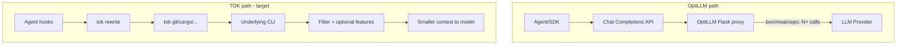
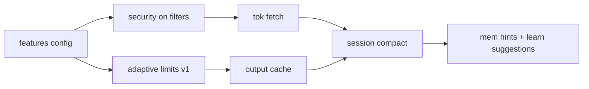

# OptiLLM → TOK Feature Feasibility & Top 5 Roadmap

## Strategic frame (your choices applied)

| Product | Layer | Optimizes for | Typical token effect |
|---------|-------|---------------|---------------------|
| **OptiLLM** | OpenAI-compatible HTTP proxy | Answer **quality** (reasoning, verification) | **Increases** billed tokens (multi-sample, multi-agent) |
| **TOK** (current + desired) | Shell/hook proxy | **Context efficiency** for coding agents | **Decreases** tokens in tool output |

You chose **CLI/hook only** and **inspire-only (Rust)**. That rules out porting most OptiLLM “techniques” verbatim—they require intercepting `POST /v1/chat/completions` and orchestrating extra model calls. The valuable work is **translating the intent** into TOK-native patterns: compress, prefetch, shield, cache, and auto-tune—without contradicting TOK’s mission.



Reference: OptiLLM loads techniques in [`optillm/server.py`](file:///Users/mantis/GIT/MANTISWARE/weeklyProjects/optillm/optillm/server.py) (`known_approaches` + `plugins/*_plugin.py` with `SLUG` + `run()`). TOK extends via [`src/main.rs`](src/main.rs) `Commands`, [`src/cli_dispatch.rs`](src/cli_dispatch.rs), [`src/discover/rules.rs`](src/discover/rules.rs), and [`~/.config/tok/config.toml`](src/core/config.rs).

---

## Full technique matrix (feasibility for CLI-only TOK)

**Legend:** Effort = engineering time in TOK; Viability = fit with “fewer tokens, Rust, toggleable.”

### Inference techniques (OptiLLM `known_approaches`)

| Technique | OptiLLM reality | TOK viability | Effort | Recommendation |
|-----------|-----------------|---------------|--------|----------------|
| **MARS, CEPO, CoT reflection, PlanSearch, LEAP, RTO, R\*, MCTS, PVG** | Many chained LLM calls | **No** (needs API proxy) | XL | Do not port; opposite of token-saving |
| **BON, MOA, self_consistency, majority_voting, GenSelect** | N completions + selector | **No** | XL | Do not port |
| **re2 (ReRead)** | Duplicate query in prompt | **Low** | S | Optional `tok re-read` over tee files—**already partially covered** by [`src/core/tee.rs`](src/core/tee.rs) hints |
| **z3** | LLM emits code → local `exec` | **Low** | M | Niche; security/exec risk; agents already run code |
| **CoT / entropy decoding, Thinkdeeper, AutoThink, DeepConf** | Local model + logprobs | **No** | XL | Requires weights + decode hooks; out of scope |
| **Router (ModernBERT)** | Classify prompt → pick technique | **Adapt** | M | **Adaptive compression router** (see Top 5)—classify *command*, not prompt |

### Plugins

| Plugin | OptiLLM reality | TOK viability | Effort | Recommendation |
|--------|-----------------|---------------|--------|----------------|
| **privacy** | Presidio anonymize → LLM → restore | **High** | S–M | **Finish existing** [`src/security/`](src/security/) (see Top 5) |
| **readurls** | HTTP fetch + HTML strip, **0 LLM** in plugin | **High** | M | **`tok fetch`** + hook exclude rules (Top 5) |
| **compact** | 1 LLM call to summarize old turns | **Adapt** | M–L | **Heuristic session compact** from Claude JSONL (Top 5)—no cloud LLM by default |
| **memory** | Chunk + LLM extract + TF-IDF | **Partial** | M | Extend **`tok mem`** + hook hints (Top 5)—TOK already has structural memory |
| **compact** (composable) | Pairs with moa/bon | N/A | — | Ignore composition; TOK doesn’t stack quality techniques |
| **mcp** | MCP client driving tool loop | **Different** | L | Ship **TOK as MCP server** (expose mem/forgemap/gain)—not OptiLLM’s client |
| **executecode / coc** | Python exec in chat loop | **Low** | M | Agent already executes; TOK should **compress stdout** only |
| **json (Outlines)** | Constrained generation | **No** | — | Wrong layer |
| **web_search / deep_research** | Selenium + many LLM calls | **No** | XL | Heavy deps; conflicts with CLI-only |
| **proxy (providers)** | Multi-provider LB | **No** | L | Different product; [`tok proxy`](src/cli_dispatch.rs) is raw shell passthrough |
| **spl** | Learn strategies into system prompt | **Adapt** | M | Align with **`tok learn`** + auto TOML/rule suggestions (not prompt injection) |
| **deepthink / longcepo / deep_research** | Inference-time scaling | **No** | XL | API-layer only |
| **router** | Route to technique slug | **Adapt** | M | See adaptive compression (Top 5) |

### TOK-native ideas (not in OptiLLM, high leverage)

| Idea | Inspired by | Why add |
|------|-------------|---------|
| **Tool output cache** | — | Repeated `git status` / `cargo test` in one session → zero re-run tokens |
| **Intensity presets per command class** | router + Thinkdeeper | Auto `-u` / limits without user tuning |
| **Unified feature toggles** | OptiLLM slug model | `[features]` in config.toml |

---

## Effort tiers (CLI-only, Rust)

### Quick (days–1 week each)

1. **`[features]` section in config** — boolean toggles + env overrides (`TOK_FEATURE_FETCH=0`).
2. **Wire security on filter stdout** — `process_input` on filtered output paths; document `process_output` for future hook JSON adapters ([`docs/tasks/tok-security-layer-cursor-implementation.md`](docs/tasks/tok-security-layer-cursor-implementation.md) already describes this; code gap: security mainly on `tok proxy` metrics today).
3. **Adaptive compression presets** — map command families in [`src/discover/rules.rs`](src/discover/rules.rs) to `LimitsConfig` / global `-u` (no ML required v1).
4. **Strengthen tee + `tok read` recovery UX** — ReRead analog; low cost, high agent recovery value.

### Medium (2–4 weeks each)

5. **`tok fetch <url>`** — port readurls behavior: fetch, strip boilerplate, markdown-ish text, hard `max_chars`, respect `hooks.exclude_commands` for raw `curl`.
6. **Session compact (heuristic)** — scan Claude JSONL ([`src/discover/provider.rs`](src/discover/provider.rs)), emit structured primer (Scope, decisions, files)—**no provider call**; optional SLM pass using existing [`src/security/slm`](src/security/slm).
7. **Tool output cache** — SQLite keyed by `(cwd, cmd hash)` with TTL; toggle `features.cache`.
8. **`tok learn` → filter suggestions** — SPL-like learning for **TOML/rules**, not system prompts ([`src/learn/`](src/learn/)).

### Long (1–2+ months)

9. **Hook preprocessor pipeline** — ordered plugins: `fetch_urls_in_cmd` → `security` → `rewrite` (Rust trait chain, slug per feature).
10. **`tok mem` proactive hints** — on rewrite, append 1-line “relevant symbols” from mem FTS (memory plugin intent, no LLM extract).
11. **MCP server exposing TOK** — `tok mcp serve` for mem/forgemap/gain (replaces need for OptiLLM MCP client).

### Do not pursue (CLI-only scope)

- Port **bon/moa/cepo/mars/mcts** or any multi-completion orchestration.
- **Selenium web_search**, **Outlines json**, **provider proxy** plugin.
- **Full compact with cloud summarization** unless you later add `tok serve` (explicitly out of scope).

---

## Top 5 features (dramatic impact, toggleable, CLI-aligned)

### 1. Toggleable `[features]` framework (foundation)

**Why:** OptiLLM uses slugs (`compact&moa`); TOK needs the same ergonomics in [`config.toml`](src/core/config.rs) without a second product.

**What:**
```toml
[features]
security = true          # default off globally today; per-user choice
fetch = true             # tok fetch + URL expansion
session_compact = false
output_cache = true
adaptive_limits = true
mem_hints = false
```

**Why first:** Every other feature ships behind a flag; matches “switched on and off as the user requires.”

**Effort:** Quick | **Viability:** Essential

---

### 2. Complete privacy/security on all agent-visible output (OptiLLM `privacy` → TOK security)

**Why:** Biggest **trust + cost** win: secrets/PII never burn context or leak to providers; avoids failed retries after redaction surprises.

**What:**
- Run [`process_input`](src/security/mod.rs) on **filtered command stdout** (not only proxy metrics).
- Optional `process_output` for agents with structured hook JSON (Copilot/Gemini paths in [`src/hooks/`](src/hooks/)).
- Modes already exist: observe / balanced / strict ([`SecurityConfig`](src/security/config.rs)).

**Why not full Presidio port:** TOK’s regex + optional local SLM matches CLI-only, no Python stack; add entity types incrementally.

**Effort:** Quick–Medium | **Viability:** High (80% built)

---

### 3. `tok fetch` — URL ingest & distill (OptiLLM `readurls`)

**Why:** Agents paste docs URLs; raw `curl` dumps HTML noise (10–50× tokens). OptiLLM’s readurls does **zero LLM calls**—ideal TOK fit.

**What:**
- New command: `tok fetch https://…` → compressed text + token estimate.
- Optional hook: detect URLs in command string → suggest `tok fetch` (or auto only with `features.fetch_auto = true`).
- Reuse patterns from [`src/cmds/cloud/wget_cmd.rs`](src/cmds/cloud/wget_cmd.rs) (compact URL reporting).

**Effort:** Medium | **Viability:** High

---

### 4. Adaptive compression router (OptiLLM `router` → command-class limits)

**Why:** Users shouldn’t memorize `-u` vs default. Router’s insight—“pick strategy from task”—maps to **pick compression tier from command**.

**What:**
- Static table v1: `git log` → aggressive truncation; `git diff` → tee + higher limit; `test` → keep failures only.
- v2 (optional): tiny local classifier or SLM gate (reuse SLM infra) — still **no cloud LLM**.
- Integrate with [`LimitsConfig`](src/core/config.rs) and discover rules.

**Effort:** Quick (v1) / Medium (v2) | **Viability:** High — unique TOK value OptiLLM doesn’t provide

---

### 5. Session context primer + tool output cache (OptiLLM `compact` + `memory`, TOK-native cache)

**Why:** Two biggest sources of wasted LLM context in long sessions: (a) re-sending unchanged tool output, (b) no durable “where we left off” summary without paying for compact’s LLM call.

**What:**

**5a. `tok session compact`** (compact-inspired, **no API**):
- Input: Claude JSONL via existing [`ClaudeProvider`](src/discover/provider.rs).
- Output: structured markdown primer (Scope, decisions, files, pending)—same sections as OptiLLM compact’s template in [`compact_plugin.py`](file:///Users/mantis/GIT/MANTISWARE/weeklyProjects/optillm/optillm/plugins/compact_plugin.py), filled heuristically.
- Optional: one **local SLM** pass if `features.session_compact_slm = true`.

**5b. Tool output cache** (TOK-original):
- Cache filtered output hash `(cwd, argv, mtime of repo HEAD for git cmds)`.
- Hook hit: return `[cached N min ago]` + compact output → massive savings on agent loops.

**5c. Light `mem_hints`** (memory-inspired):
- When rewriting `Read`/`Grep`, attach 1-line symbol hint from **`tok mem search`** if `features.mem_hints`.

**Effort:** Medium–Long | **Viability:** High for cache; Medium for session compact

---

## Honorable mentions (next five after top 5)

| Feature | OptiLLM source | Notes |
|---------|----------------|-------|
| **`tok learn` → `.tok/filters.toml` suggestions** | spl | Learn **commands**, not reasoning strategies |
| **MCP server for TOK tools** | mcp | Better than porting MCP client |
| **Phase 2 analytics** ([`checklist.md`](checklist.md)) | — | API spend vs TOK savings; no OptiLLM port |
| **ForgeMap + mem in rewrite hints** | memory | Structural context without LLM extract |
| **Exclude list expansion** | — | `hooks.exclude_commands` for `curl`, browsers when `fetch` enabled |

---

## Why we should NOT add (argued briefly)

| OptiLLM feature | Reason |
|-----------------|--------|
| BON / MOA / CEPO / MARS / MCTS | Multiplies API cost; TOK users choose it for **savings** |
| Majority voting / GenSelect | Quality selection, not context reduction |
| Z3 / executecode in TOK | Execution belongs in agent sandbox; TOK filters **results** |
| Web search / deep_research | Selenium + research loops = ops burden, token explosion |
| JSON / Outlines | Generation constraint layer, not shell proxy |
| Provider proxy plugin | Different product from `tok proxy` |
| Cloud compact | 1 LLM call per compact **increases** spend; heuristic + optional local SLM fits TOK |

---

## Suggested implementation order



1. `[features]` + config/docs  
2. Security on filter paths  
3. Adaptive limits v1  
4. `tok fetch`  
5. Output cache  
6. Session compact (+ optional SLM)  
7. mem hints + learn → TOML suggestions  

Each step: unit/snapshot tests per [`.claude/skills/tok-tdd/SKILL.md`](.claude/skills/tok-tdd/SKILL.md); gate with `cargo fmt --all && cargo clippy --all-targets && cargo test --all`.

---

## Success metrics

- **Token savings:** `tok gain` delta on repeated commands (cache); fetch vs raw curl (A/B fixture).  
- **UX:** `tok config` shows clear feature toggles; `tok doctor` validates fetch/SLM/security.  
- **Safety:** `tok security-inspect` on sample logs with features on.  
- **No regression:** Default config = today’s behavior (all new features off except existing defaults).

---

## Summary

OptiLLM is an **inference-quality multiplier**; TOK is a **context compressor**. Under CLI-only + Rust, only **privacy, readurls, compact (heuristic), memory (structural), and router (as adaptive limits)** translate cleanly. The **top five** that dramatically improve TOK without an API proxy: **(1) feature flags, (2) security everywhere, (3) tok fetch, (4) adaptive compression router, (5) session primer + tool output cache (+ mem hints)**.
